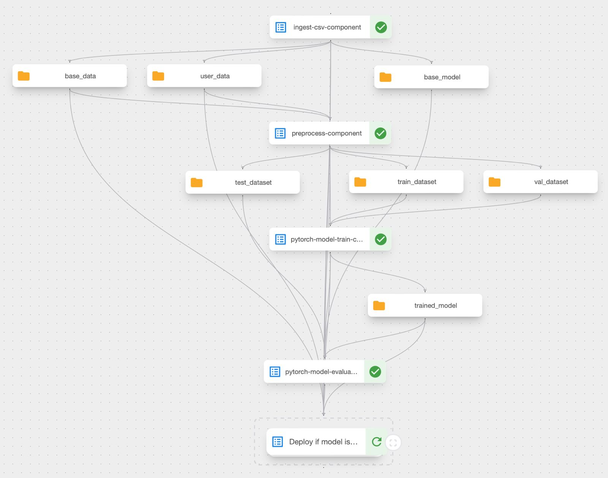
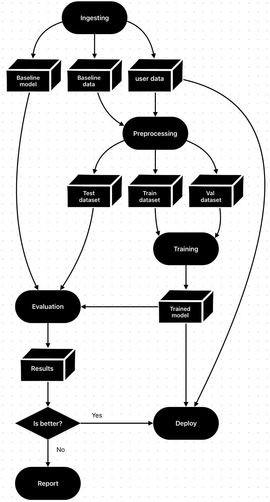

# Pipeline Explanation

### Kubernetes and Kubeflow
To create this pipeline I used Kubeflow. This is a nice tool to orchestate processes and make them scalable

For this case I'm running kubeflow locally in my Mac M1. So, I started a k3s cluster using k3d where kubeflow is gonna be running.

### Data
I extract the full diamonds dataset from this github repository: [link](https://github.com/Pratik94229/Diamond-Price-Prediction-End-to-End-Project/blob/main/artifacts/raw.csv) \
Complete dataset has +192k records! For this case, I will use only 2k examples.

### Training Aspects
I'll train the model with old data + new data from scratch to handle data drifting as best as possible.
However I know this is not the best approach for every case. Another approach is doing incremental training, I mean, training the pre-trained model with new data only.
This approach is very useful for model as a service and fast iteration

### Kubeflow Pipeline Graph

### Next Steps:
1. Improve Metadata Capture
2. Make more generic pipeline components
3. Create an docker image to avoid code repetition in kubeflow component
